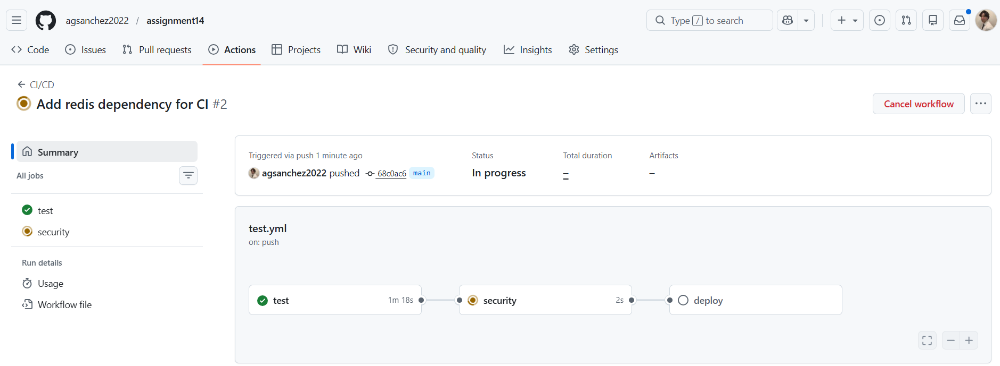
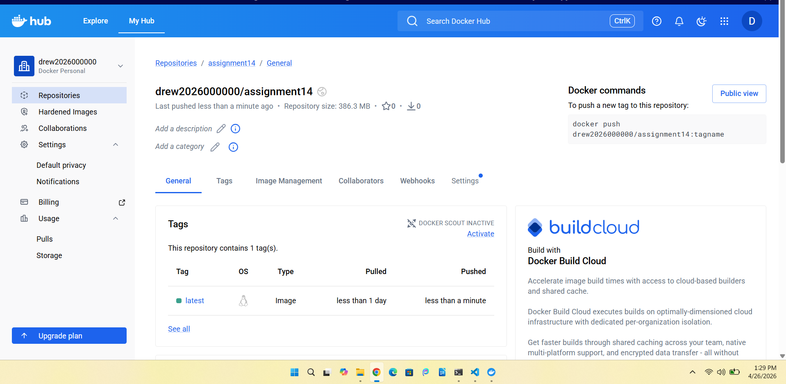
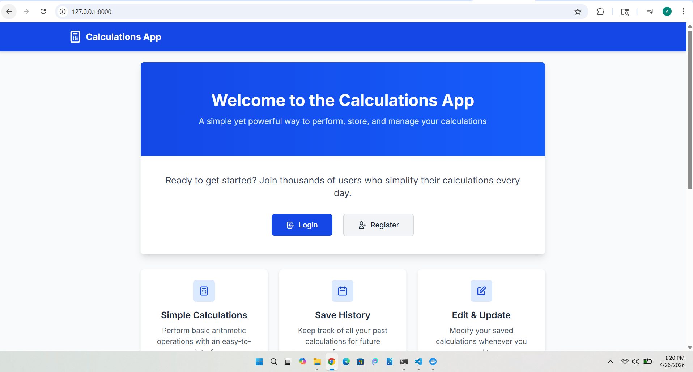
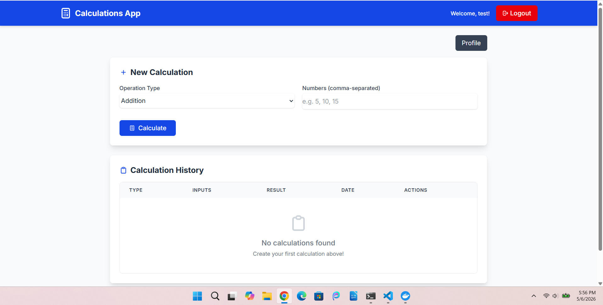
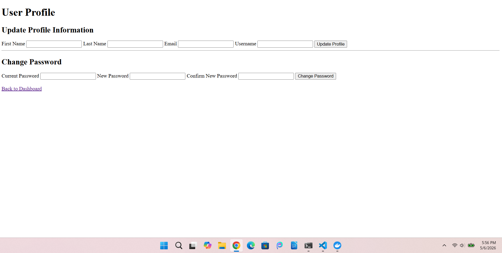

# Final Project – Full-Stack FastAPI Calculator Application with User Profile Management

This project builds on the previous calculator API application by expanding the platform into a more complete full-stack web application with authenticated user management, calculation history tracking, BREAD functionality, testing, and containerized deployment.

The backend was developed using FastAPI, SQLAlchemy, and Pydantic. Users can securely register, log in, and manage their own calculations through authenticated API endpoints. Each calculation supports mathematical operations such as addition, subtraction, multiplication, and division, while ensuring users can only access and modify their own data.

The application implements full BREAD (Browse, Read, Edit, Add, Delete) functionality for calculations. Users can create calculations, view previous results, edit existing calculations, and delete records directly through the web interface.

As part of the final project enhancements, a new user profile management feature was added. Authenticated users can now:
- View their account information
- Update profile details such as username, email, and name
- Securely change their password

The frontend uses HTML templates, JavaScript, and FastAPI routing to provide a user-friendly interface for interacting with backend APIs. Client-side validation was added to improve usability and prevent invalid data submissions before requests are sent to the backend.

Testing was completed using both Pytest and Playwright. The project includes unit tests, integration tests, and end-to-end browser testing to validate API behavior, authentication flows, and frontend functionality. GitHub Actions was configured to automate testing and CI/CD workflows.

The application is containerized using Docker and managed through Docker Compose for consistent local development and deployment environments.

---

## 🧪 How to Run Tests Locally

1. Activate virtual environment:
```bash
source venv/bin/activate
```

2. Install dependencies:
```bash
pip install -r requirements.txt
```

3. Start Docker:
```bash
docker compose up -d
```

4. Run tests:
```bash
pytest
```

---

## 🐳 Docker Hub Repository

https://hub.docker.com/repository/docker/drew2026000000/assignment14/general

---

## 📸 Screenshots

### GitHub Actions


### Docker


### Application Running in Browser:






---

## 📸 Reflection

This project helped reinforce how a full-stack application works from both the backend and frontend perspectives. Instead of only creating API endpoints, I had to connect authentication, database operations, frontend interaction, testing, and deployment into one complete application.
One of the biggest improvements added during the final project was the user profile management feature. Implementing profile updates and password change functionality helped me better understand authentication workflows, secure password handling, and protected routes within FastAPI applications.
Working with BREAD operations also helped me better understand how data flows between the frontend, API layer, and database. Since calculations were tied to authenticated users, I also had to make sure authorization was handled properly so users could only access their own records.
Another important part of the project was testing. Pytest and Playwright helped verify both backend functionality and real user interaction flows. Running tests through GitHub Actions also showed the importance of CI/CD pipelines and maintaining stable environments between local development and automated deployments.
Docker and Docker Compose made it easier to keep dependencies and services consistent across environments, especially when working with PostgreSQL and automated testing.
Overall, this project brought together backend development, frontend integration, authentication, testing, containerization, and deployment into a single application. It felt much closer to building a real-world software project rather than completing isolated assignments.
